# BattleShip Game

[liveproject](https://battleship-the-game.herokuapp.com/)

## UX

- User Goals

- Creator Goals

- Development Plans

## Features

## How to play

## Model

## Technologies

## Testing

## Deployment

## Credits

# BattleShip the Game

BattleShipGame is a python terminal based game. User plays against the computer. Each player has 7 chance to find the 5 available ships in the ocean.

## UX

### User Goals:

1. First time players:

- easy understandable game area

- clear visible rules

- fun game

2. Returning players:

- fun game

- able to customize game size and with that the game difficulities changing

### Creator Goals:

- user friendly game

- clear rules

- customizable grid so player can change the size of the field

### Development Plans

I. Strategy:

#### Focus of the game

1. Target audience:

- everyone who likes battleship game

- new players

- returning players

2. Demographics

- any age

3. Psyhographics

- any people who want to try battleship

- hardcore battleship gamers

II. Scope

1. Content requirements:

- players will be looking for a fun game

- customizable grid size

- easy understandable rules

2. Funcionality requriments:

- easy navigation

- smooth gameplay

III. Structure:

IV. Surface

colores: different colores for rules and name and players to make it more visible

## Features

1. existing features:

- starting page 

- player can type the name

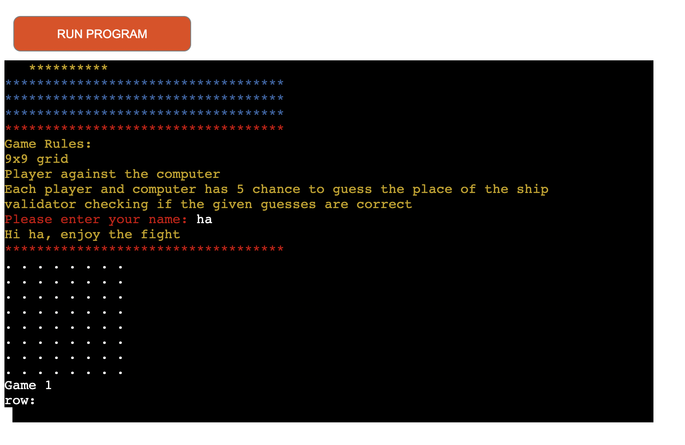

- random board generator: player can decide what size is desired for the game area => the difficulities will increase also, because to find the ships will be harder or easier

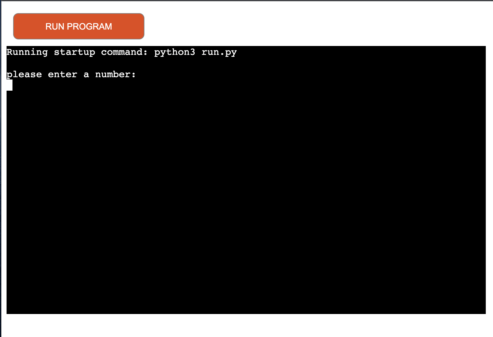

- guess number

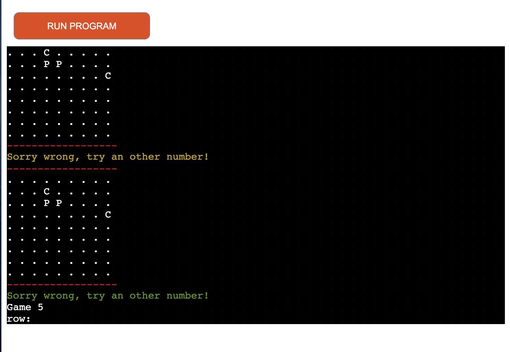

- validator for number out of range

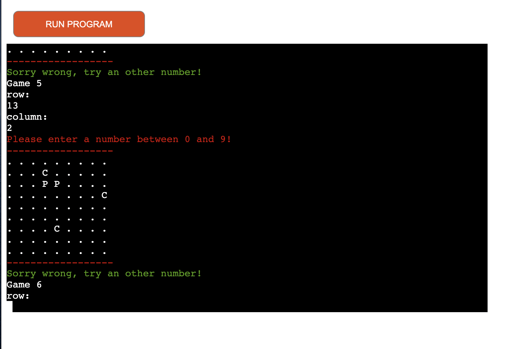

- validator for not a number

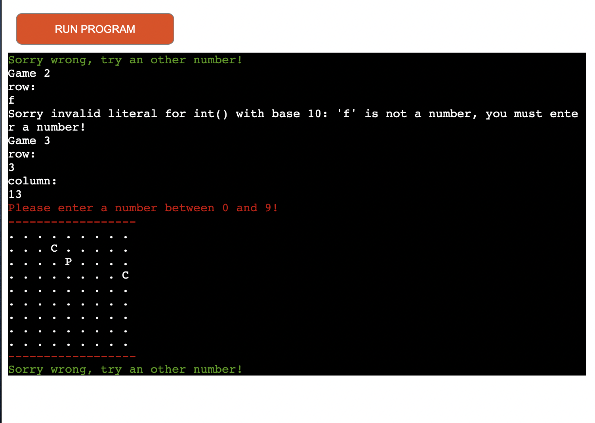

2. features to implement:

- scoreboard 

## How to play

- the player can choose a number which will set up the grid size

- enter the player name

- the game starts: 

the player takes the first guess and than the computer. Each player has 7 chence to find the 5 ships in the field. After 7 turn the game will finish.

1. player signs: 

- when a hit is "*"

- when miss "P"

2. computer signs:

- when a hit is "*"

- when miss "C"

- after guessing the number either a warning message or a message about found the ship, which has different colors for player and computer. Player color is yellow, computer is green.

## Model

- the game board is in a class. The game creates 1 board which contains the player guesses and the computer guesses. 

- the game class stores the number of ships, the size, the game turns and the player name.

- the methods what is in the game class: player_guess and computer_guess and print_board.

## Technologies

- Used Languages: Python

- Libraries: 
1. random.randint: to generate a random number for the computer guess and also for the ships on the field area

2. termcolor: to color the text what is printed to the screen, player and computer has different colors, rules and error messages also has different colors

## Testing

The game was tested with all scenarios, given number outside of the range, given other characters also, validator is working correctly checking and giving the suitable warning message

Given no entry number error:

- if player gives no number at entry question where the game requiers a number to set the grid size, the game will crash

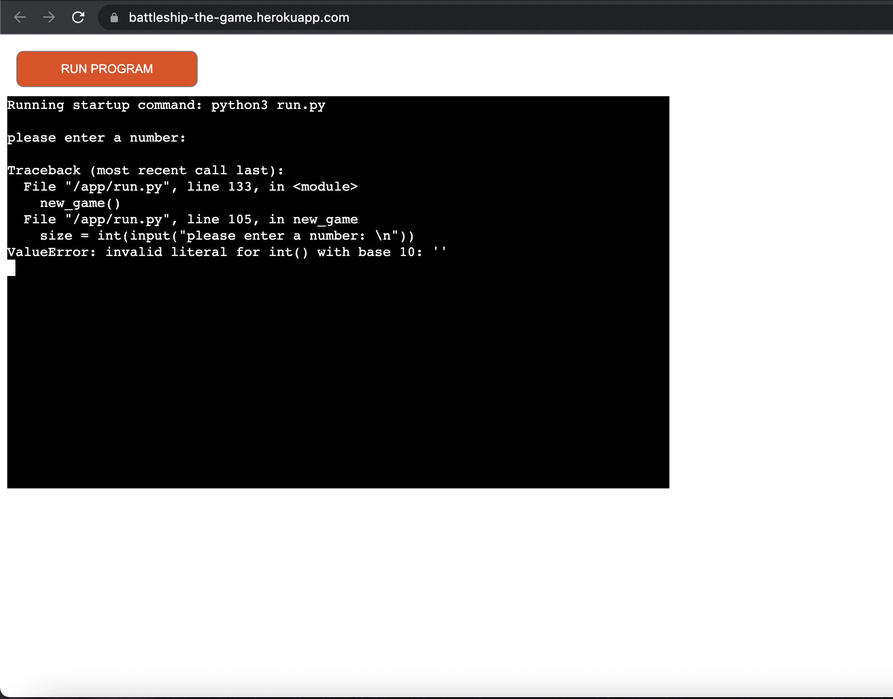

The previous error fixed:

- if player give no input at the entry where name is required:

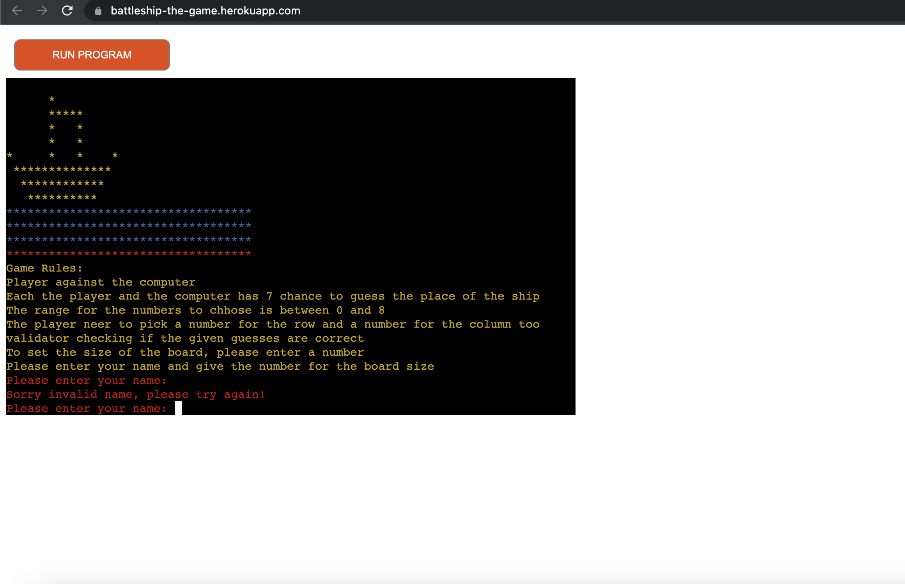

- if player give no input when size set required

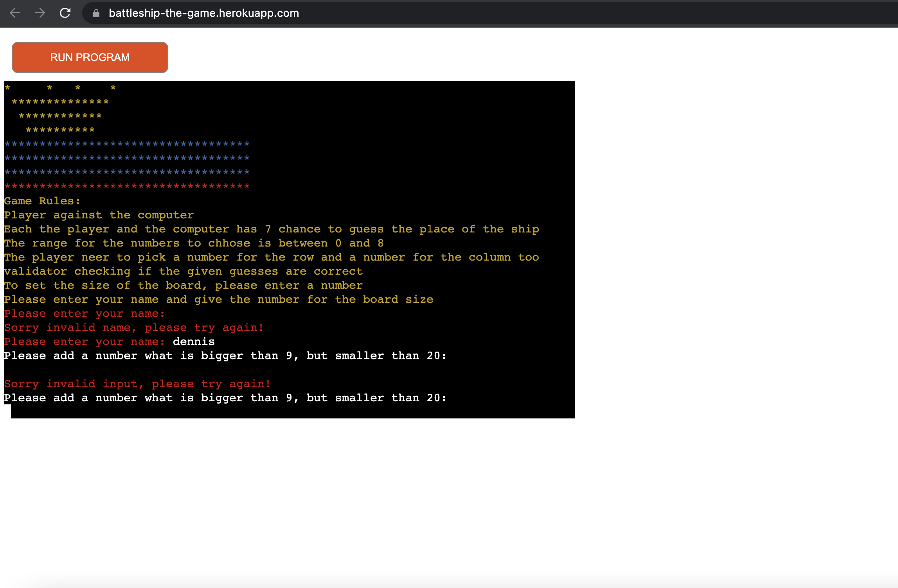

- if player give the number to set grid size, but the number is out of the given range

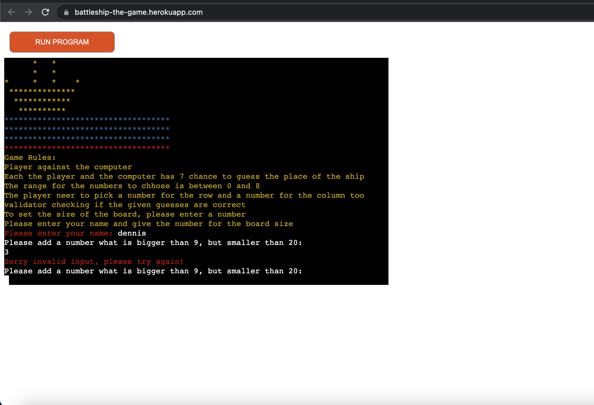

- in game error, when player give no input

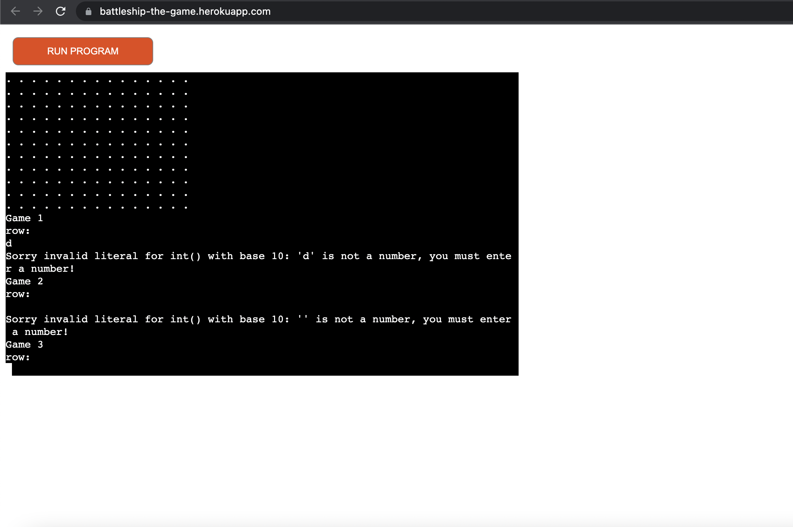

- in game when player input is not an int

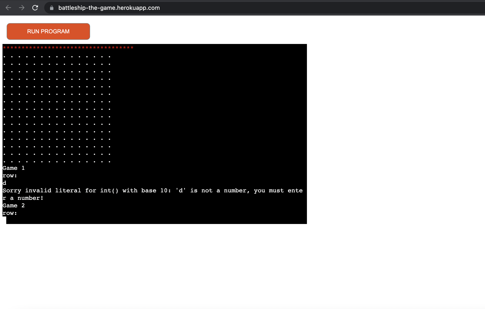

Pep8 online validator for the python code check

- line too long and trailing whitespace returned

Looking for solutions from stackoverflow, but did not manage to fix it.

## Deployment

- The project was developed and stored in git.

- The source file was regularly pushed to repository GitHub 

- deployed on Heroku, using Code Institute mock terminal

## Credits

- Code Institute for the deployment terminal and the learning materials, videos and exercises.

